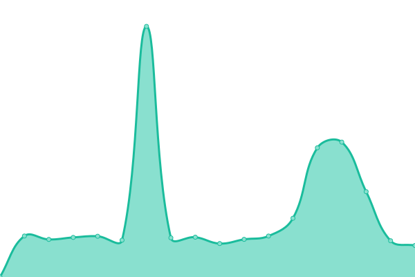
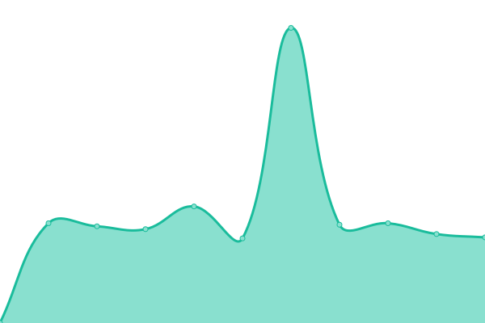
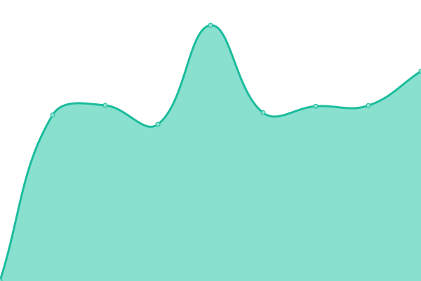
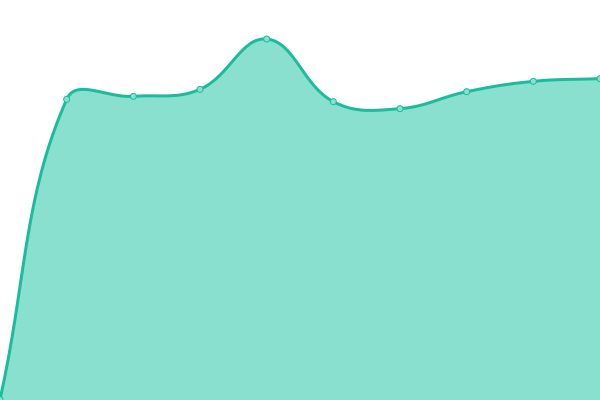

# [📈 Live Status](https://snigdhalinux.github.io/snigdhaos-upptime): <!--live status--> **🟧 Partial outage**

This repository contains the open-source uptime monitor and status page for [SNIGDHA OS](https://snigdhaos.org), powered by [Upptime](https://github.com/upptime/upptime).

With [Upptime](https://upptime.js.org), you can get your own unlimited and free uptime monitor and status page, powered entirely by a GitHub repository. We use [Issues](https://github.com/snigdhalinux/snigdhaos-upptime/issues) as incident reports, [Actions](https://github.com/snigdhalinux/snigdhaos-upptime/actions) as uptime monitors, and [Pages](https://snigdhalinux.github.io/snigdhaos-upptime) for the status page.

<!--start: status pages-->
<!-- This summary is generated by Upptime (https://github.com/upptime/upptime) -->
<!-- Do not edit this manually, your changes will be overwritten -->
<!-- prettier-ignore -->
| URL | Status | History | Response Time | Uptime |
| --- | ------ | ------- | ------------- | ------ |
|  [GLOBAL-MIRROR](https://mirror.snigdhaos.org) | 🟩 Up | [global-mirror.yml](https://github.com/snigdhalinux/snigdhaos-upptime/commits/HEAD/history/global-mirror.yml) | 

 1166ms
     
 | 

<a href="https://snigdhalinux.github.io/snigdhaos-upptime/history/global-mirror">100.00%</a>
    

|  [BD-MIRROR](https://bd-mirror.snigdhaos.org) | 🟩 Up | [bd-mirror.yml](https://github.com/snigdhalinux/snigdhaos-upptime/commits/HEAD/history/bd-mirror.yml) | 

 1723ms
     
 | 

<a href="https://snigdhalinux.github.io/snigdhaos-upptime/history/bd-mirror">94.63%</a>
    

|  [IN-MIRROR](https://in-mirror.snigdhaos.org) | 🟩 Up | [in-mirror.yml](https://github.com/snigdhalinux/snigdhaos-upptime/commits/HEAD/history/in-mirror.yml) | 

 1077ms
     
 | 

<a href="https://snigdhalinux.github.io/snigdhaos-upptime/history/in-mirror">94.64%</a>
    

|  [US-MIRROR](https://us-mirror.snigdhaos.org) | 🟩 Up | [us-mirror.yml](https://github.com/snigdhalinux/snigdhaos-upptime/commits/HEAD/history/us-mirror.yml) | 

 1256ms
     
 | 

<a href="https://snigdhalinux.github.io/snigdhaos-upptime/history/us-mirror">94.64%</a>
    

|  [UK-MIRROR](https://uk-mirror.snigdhaos.org) | 🟩 Up | [uk-mirror.yml](https://github.com/snigdhalinux/snigdhaos-upptime/commits/HEAD/history/uk-mirror.yml) | 

 1071ms
     
 | 

<a href="https://snigdhalinux.github.io/snigdhaos-upptime/history/uk-mirror">94.65%</a>
    

|  [GE-MIRROR](https://ge-mirror.snigdhaos.org) | 🟥 Down | [ge-mirror.yml](https://github.com/snigdhalinux/snigdhaos-upptime/commits/HEAD/history/ge-mirror.yml) | 

 0ms
     
 | 

<a href="https://snigdhalinux.github.io/snigdhaos-upptime/history/ge-mirror">0.00%</a>
    

|  [RU-MIRROR](https://ru-mirror.snigdhaos.org) | 🟩 Up | [ru-mirror.yml](https://github.com/snigdhalinux/snigdhaos-upptime/commits/HEAD/history/ru-mirror.yml) | 

 966ms
     
 | 

<a href="https://snigdhalinux.github.io/snigdhaos-upptime/history/ru-mirror">84.70%</a>
    

|  [WW-MIRROR](https://ww-mirror.snigdhaos.org) | 🟩 Up | [ww-mirror.yml](https://github.com/snigdhalinux/snigdhaos-upptime/commits/HEAD/history/ww-mirror.yml) | 

 1615ms
     
 | 

<a href="https://snigdhalinux.github.io/snigdhaos-upptime/history/ww-mirror">94.68%</a>
    

|  [AF-MIRROR](https://af-mirror.snigdhaos.org) | 🟩 Up | [af-mirror.yml](https://github.com/snigdhalinux/snigdhaos-upptime/commits/HEAD/history/af-mirror.yml) | 

 1055ms
     
 | 

<a href="https://snigdhalinux.github.io/snigdhaos-upptime/history/af-mirror">84.71%</a>
    

|  [JP-MIRROR](https://bd-mirror.snigdhaos.org) | 🟩 Up | [jp-mirror.yml](https://github.com/snigdhalinux/snigdhaos-upptime/commits/HEAD/history/jp-mirror.yml) | 

 700ms
     
 | 

<a href="https://snigdhalinux.github.io/snigdhaos-upptime/history/jp-mirror">94.70%</a>
    

|  [SNIGDHA-GLOBE](https://snigdhaos.org) | 🟩 Up | [snigdha-globe.yml](https://github.com/snigdhalinux/snigdhaos-upptime/commits/HEAD/history/snigdha-globe.yml) | 

 7275ms
     
 | 

<a href="https://snigdhalinux.github.io/snigdhaos-upptime/history/snigdha-globe">94.70%</a>
    

|  [SNIGDHA-BUILD](https://iso.snigdhaos.org) | 🟩 Up | [snigdha-build.yml](https://github.com/snigdhalinux/snigdhaos-upptime/commits/HEAD/history/snigdha-build.yml) | 

 937ms
     
 | 

<a href="https://snigdhalinux.github.io/snigdhaos-upptime/history/snigdha-build">94.71%</a>
    

|  [SNIGDHA-FORUM](https://forum.snigdhaos.org) | 🟩 Up | [snigdha-forum.yml](https://github.com/snigdhalinux/snigdhaos-upptime/commits/HEAD/history/snigdha-forum.yml) | 

 2314ms
     
 | 

<a href="https://snigdhalinux.github.io/snigdhaos-upptime/history/snigdha-forum">95.94%</a>
    

|  [SNIGDHA-WIKI](https://forum.snigdhaos.org) | 🟩 Up | [snigdha-wiki.yml](https://github.com/snigdhalinux/snigdhaos-upptime/commits/HEAD/history/snigdha-wiki.yml) | 

 1680ms
     
 | 

<a href="https://snigdhalinux.github.io/snigdhaos-upptime/history/snigdha-wiki">62.48%</a>
    

|  [SNIGDHA-STATUS](https://snigdhalinux.github.io/snigdhaos-upptime/) | 🟩 Up | [snigdha-status.yml](https://github.com/snigdhalinux/snigdhaos-upptime/commits/HEAD/history/snigdha-status.yml) | 

 72ms
     
 | 

<a href="https://snigdhalinux.github.io/snigdhaos-upptime/history/snigdha-status">100.00%</a>
    

<!--end: status pages-->

[**Visit our status website →**](https://snigdhalinux.github.io/snigdhaos-upptime)

## 📄 License

- Powered by: [Upptime](https://github.com/upptime/upptime)
- Code: [MIT](./LICENSE) © [Anand Chowdhary](https://anandchowdhary.com), supported by [Pabio](https://pabio.com)
- Data in the `./history` directory: [Open Database License](https://opendatacommons.org/licenses/odbl/1-0/)
