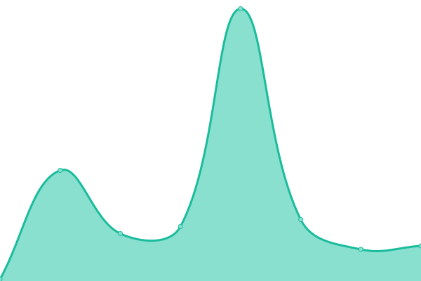

# [📈 Live Status](https://snigdhalinux.github.io/snigdhaos-upptime): <!--live status--> **🟩 All systems operational**

This repository contains the open-source uptime monitor and status page for [SNIGDHA OS](https://snigdhaos.org), powered by [Upptime](https://github.com/upptime/upptime).

With [Upptime](https://upptime.js.org), you can get your own unlimited and free uptime monitor and status page, powered entirely by a GitHub repository. We use [Issues](https://github.com/snigdhalinux/snigdhaos-upptime/issues) as incident reports, [Actions](https://github.com/snigdhalinux/snigdhaos-upptime/actions) as uptime monitors, and [Pages](https://snigdhalinux.github.io/snigdhaos-upptime) for the status page.

<!--start: status pages-->
<!-- This summary is generated by Upptime (https://github.com/upptime/upptime) -->
<!-- Do not edit this manually, your changes will be overwritten -->
<!-- prettier-ignore -->
| URL | Status | History | Response Time | Uptime |
| --- | ------ | ------- | ------------- | ------ |
|  [SNIGDHAOS-GLOBE](https://snigdhaos.org) | 🟩 Up | [snigdhaos-globe.yml](https://github.com/snigdhalinux/snigdhaos-upptime/commits/HEAD/history/snigdhaos-globe.yml) | 

 4457ms
     
 | 

<a href="https://snigdhalinux.github.io/snigdhaos-upptime/history/snigdhaos-globe">95.58%</a>
    

|  [SNIGDHAOS-GLOCAL](https:/snigdhalinux.github.io/) | 🟩 Up | [snigdhaos-glocal.yml](https://github.com/snigdhalinux/snigdhaos-upptime/commits/HEAD/history/snigdhaos-glocal.yml) | 

 44ms
     
 | 

<a href="https://snigdhalinux.github.io/snigdhaos-upptime/history/snigdhaos-glocal">100.00%</a>
    

|  [SNIGDHAOS-CORE](https://snigdhalinux.github.io/snigdhaos-core) | 🟩 Up | [snigdhaos-core.yml](https://github.com/snigdhalinux/snigdhaos-upptime/commits/HEAD/history/snigdhaos-core.yml) | 

 283ms
     
 | 

<a href="https://snigdhalinux.github.io/snigdhaos-upptime/history/snigdhaos-core">98.40%</a>
    

|  [SNIGDHAOS-SPECTRUM](https://build.snigdhaos.org/) | 🟩 Up | [snigdhaos-spectrum.yml](https://github.com/snigdhalinux/snigdhaos-upptime/commits/HEAD/history/snigdhaos-spectrum.yml) | 

 1208ms
     
 | 

<a href="https://snigdhalinux.github.io/snigdhaos-upptime/history/snigdhaos-spectrum">8.16%</a>
    

|  [SNIGDHAOS-ESHAN](https://eshan.snigdhaos.org/) | 🟩 Up | [snigdhaos-eshan.yml](https://github.com/snigdhalinux/snigdhaos-upptime/commits/HEAD/history/snigdhaos-eshan.yml) | 

 3885ms
     
 | 

<a href="https://snigdhalinux.github.io/snigdhaos-upptime/history/snigdhaos-eshan">99.56%</a>
    

|  [SNIGDHA-FORUM](https://forum.snigdhaos.org) | 🟩 Up | [snigdha-forum.yml](https://github.com/snigdhalinux/snigdhaos-upptime/commits/HEAD/history/snigdha-forum.yml) | 

 4167ms
     
 | 

<a href="https://snigdhalinux.github.io/snigdhaos-upptime/history/snigdha-forum">81.57%</a>
    

|  [SNIGDHA-WIKI](https://forum.snigdhaos.org) | 🟩 Up | [snigdha-wiki.yml](https://github.com/snigdhalinux/snigdhaos-upptime/commits/HEAD/history/snigdha-wiki.yml) | 

 2479ms
     
 | 

<a href="https://snigdhalinux.github.io/snigdhaos-upptime/history/snigdha-wiki">81.58%</a>
    

|  [SNIGDHA-STATUS](https://snigdhalinux.github.io/snigdhaos-upptime/) | 🟩 Up | [snigdha-status.yml](https://github.com/snigdhalinux/snigdhaos-upptime/commits/HEAD/history/snigdha-status.yml) | 

 28ms
     
 | 

<a href="https://snigdhalinux.github.io/snigdhaos-upptime/history/snigdha-status">100.00%</a>
    

<!--end: status pages-->

[**Visit our status website →**](https://snigdhalinux.github.io/snigdhaos-upptime)

## 📄 License

- Powered by: [Upptime](https://github.com/upptime/upptime)
- Code: [MIT](./LICENSE) © [Anand Chowdhary](https://anandchowdhary.com), supported by [Pabio](https://pabio.com)
- Data in the `./history` directory: [Open Database License](https://opendatacommons.org/licenses/odbl/1-0/)
