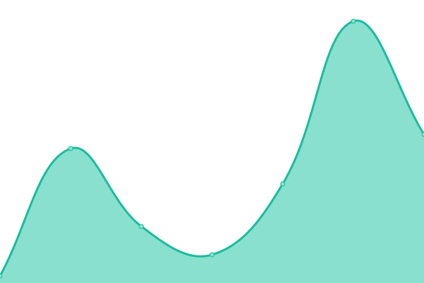

# [📈 Live Status](https://snigdhalinux.github.io/snigdhaos-upptime): <!--live status--> **🟧 Partial outage**

This repository contains the open-source uptime monitor and status page for [SNIGDHA OS](https://snigdhaos.org), powered by [Upptime](https://github.com/upptime/upptime).

With [Upptime](https://upptime.js.org), you can get your own unlimited and free uptime monitor and status page, powered entirely by a GitHub repository. We use [Issues](https://github.com/snigdhalinux/snigdhaos-upptime/issues) as incident reports, [Actions](https://github.com/snigdhalinux/snigdhaos-upptime/actions) as uptime monitors, and [Pages](https://snigdhalinux.github.io/snigdhaos-upptime) for the status page.

<!--start: status pages-->
<!-- This summary is generated by Upptime (https://github.com/upptime/upptime) -->
<!-- Do not edit this manually, your changes will be overwritten -->
<!-- prettier-ignore -->
| URL | Status | History | Response Time | Uptime |
| --- | ------ | ------- | ------------- | ------ |
|  [Eshanized-Repository](https://snigdhalinux.github.io/eshanized-repository/) | 🟩 Up | [eshanized-repository.yml](https://github.com/snigdhalinux/snigdhaos-upptime/commits/HEAD/history/eshanized-repository.yml) | 

 66ms
     
 | 

<a href="https://snigdhalinux.github.io/snigdhaos-upptime/history/eshanized-repository">100.00%</a>
    

|  [Hawkeye-Repository](https://snigdhalinux.github.io/hawkeye/) | 🟩 Up | [hawkeye-repository.yml](https://github.com/snigdhalinux/snigdhaos-upptime/commits/HEAD/history/hawkeye-repository.yml) | 

 16ms
     
 | 

<a href="https://snigdhalinux.github.io/snigdhaos-upptime/history/hawkeye-repository">100.00%</a>
    

|  [Redeye-Repository](https://snigdhalinux.github.io/redeye/) | 🟩 Up | [redeye-repository.yml](https://github.com/snigdhalinux/snigdhaos-upptime/commits/HEAD/history/redeye-repository.yml) | 

 16ms
     
 | 

<a href="https://snigdhalinux.github.io/snigdhaos-upptime/history/redeye-repository">100.00%</a>
    

|  [Arctic-Repository](https://snigdhalinux.github.io/arctic/) | 🟥 Down | [arctic-repository.yml](https://github.com/snigdhalinux/snigdhaos-upptime/commits/HEAD/history/arctic-repository.yml) | 

 15ms
     
 | 

<a href="https://snigdhalinux.github.io/snigdhaos-upptime/history/arctic-repository">0.00%</a>
    

|  [Snigdha-Web](https://snigdhaos.org/) | 🟩 Up | [snigdha-web.yml](https://github.com/snigdhalinux/snigdhaos-upptime/commits/HEAD/history/snigdha-web.yml) | 

 5874ms
     
 | 

<a href="https://snigdhalinux.github.io/snigdhaos-upptime/history/snigdha-web">100.00%</a>
    

|  [Snigdha-ISO](https://iso.snigdhaos.org/) | 🟩 Up | [snigdha-iso.yml](https://github.com/snigdhalinux/snigdhaos-upptime/commits/HEAD/history/snigdha-iso.yml) | 

 1068ms
     
 | 

<a href="https://snigdhalinux.github.io/snigdhaos-upptime/history/snigdha-iso">100.00%</a>
    

|  [Snigdha-Forum](https://forum.snigdhaos.org/) | 🟩 Up | [snigdha-forum.yml](https://github.com/snigdhalinux/snigdhaos-upptime/commits/HEAD/history/snigdha-forum.yml) | 

 1549ms
     
 | 

<a href="https://snigdhalinux.github.io/snigdhaos-upptime/history/snigdha-forum">100.00%</a>
    

|  [Snigdha-Wiki](https://wiki.snigdhaos.org/) | 🟥 Down | [snigdha-wiki.yml](https://github.com/snigdhalinux/snigdhaos-upptime/commits/HEAD/history/snigdha-wiki.yml) | 

 0ms
     
 | 

<a href="https://snigdhalinux.github.io/snigdhaos-upptime/history/snigdha-wiki">38.90%</a>
    

|  [Snigdha-Upptime](https://snigdhalinux.github.io/snigdhaos-upptime/) | 🟩 Up | [snigdha-upptime.yml](https://github.com/snigdhalinux/snigdhaos-upptime/commits/HEAD/history/snigdha-upptime.yml) | 

 19ms
     
 | 

<a href="https://snigdhalinux.github.io/snigdhaos-upptime/history/snigdha-upptime">100.00%</a>
    

<!--end: status pages-->

[**Visit our status website →**](https://snigdhalinux.github.io/snigdhaos-upptime)

## 📄 License

- Powered by: [Upptime](https://github.com/upptime/upptime)
- Code: [MIT](./LICENSE) © [Anand Chowdhary](https://anandchowdhary.com), supported by [Pabio](https://pabio.com)
- Data in the `./history` directory: [Open Database License](https://opendatacommons.org/licenses/odbl/1-0/)
