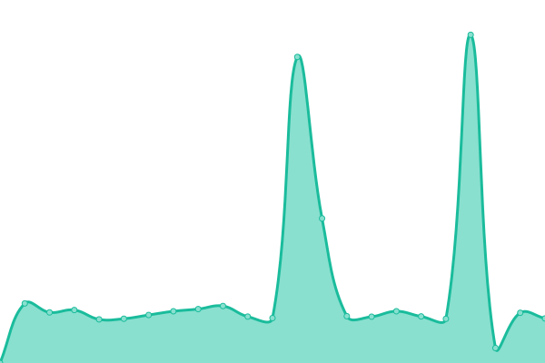
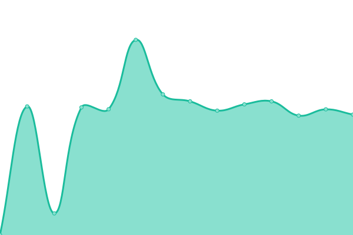
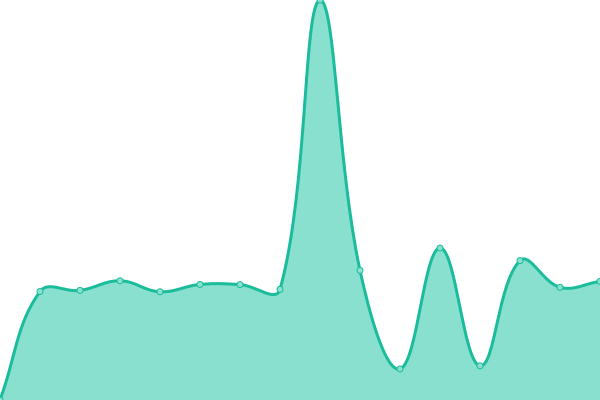
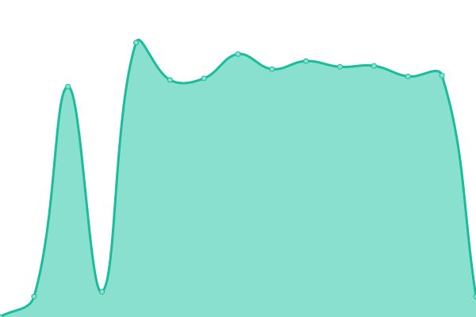

# [📈 Live Status](https://snigdhalinux.github.io/snigdhaos-upptime): <!--live status--> **🟩 All systems operational**

This repository contains the open-source uptime monitor and status page for [SNIGDHA OS](https://snigdhaos.org), powered by [Upptime](https://github.com/upptime/upptime).

With [Upptime](https://upptime.js.org), you can get your own unlimited and free uptime monitor and status page, powered entirely by a GitHub repository. We use [Issues](https://github.com/snigdhalinux/snigdhaos-upptime/issues) as incident reports, [Actions](https://github.com/snigdhalinux/snigdhaos-upptime/actions) as uptime monitors, and [Pages](https://snigdhalinux.github.io/snigdhaos-upptime) for the status page.

<!--start: status pages-->
<!-- This summary is generated by Upptime (https://github.com/upptime/upptime) -->
<!-- Do not edit this manually, your changes will be overwritten -->
<!-- prettier-ignore -->
| URL | Status | History | Response Time | Uptime |
| --- | ------ | ------- | ------------- | ------ |
|  [SNIGDHA-GLOBE](https://snigdhaos.org) | 🟩 Up | [snigdha-globe.yml](https://github.com/snigdhalinux/snigdhaos-upptime/commits/HEAD/history/snigdha-globe.yml) | 

 4829ms
     
 | 

<a href="https://snigdhalinux.github.io/snigdhaos-upptime/history/snigdha-globe">99.75%</a>
    

|  [SNIGDHA-ARCTIC](https://builds.snigdhaos.org/repo/arctic) | 🟩 Up | [snigdha-arctic.yml](https://github.com/snigdhalinux/snigdhaos-upptime/commits/HEAD/history/snigdha-arctic.yml) | 

 1324ms
     
 | 

<a href="https://snigdhalinux.github.io/snigdhaos-upptime/history/snigdha-arctic">100.00%</a>
    

|  [SNIGDHA-BADBLOOD](https://builds.snigdhaos.org/repo/badblood) | 🟩 Up | [snigdha-badblood.yml](https://github.com/snigdhalinux/snigdhaos-upptime/commits/HEAD/history/snigdha-badblood.yml) | 

 459ms
     
 | 

<a href="https://snigdhalinux.github.io/snigdhaos-upptime/history/snigdha-badblood">100.00%</a>
    

|  [SNIGDHA-CORE](https://builds.snigdhaos.org/repo/snigdha-core) | 🟩 Up | [snigdha-core.yml](https://github.com/snigdhalinux/snigdhaos-upptime/commits/HEAD/history/snigdha-core.yml) | 

 458ms
     
 | 

<a href="https://snigdhalinux.github.io/snigdhaos-upptime/history/snigdha-core">100.00%</a>
    

|  [SNIGDHA-FORUM](https://forum.snigdhaos.org) | 🟩 Up | [snigdha-forum.yml](https://github.com/snigdhalinux/snigdhaos-upptime/commits/HEAD/history/snigdha-forum.yml) | 

 3283ms
     
 | 

<a href="https://snigdhalinux.github.io/snigdhaos-upptime/history/snigdha-forum">100.00%</a>
    

|  [SNIGDHA-WIKI](https://forum.snigdhaos.org) | 🟩 Up | [snigdha-wiki.yml](https://github.com/snigdhalinux/snigdhaos-upptime/commits/HEAD/history/snigdha-wiki.yml) | 

 2529ms
     
 | 

<a href="https://snigdhalinux.github.io/snigdhaos-upptime/history/snigdha-wiki">100.00%</a>
    

|  [SNIGDHA-STATUS](https://snigdhalinux.github.io/snigdhaos-upptime/) | 🟩 Up | [snigdha-status.yml](https://github.com/snigdhalinux/snigdhaos-upptime/commits/HEAD/history/snigdha-status.yml) | 

 82ms
     
 | 

<a href="https://snigdhalinux.github.io/snigdhaos-upptime/history/snigdha-status">100.00%</a>
    

<!--end: status pages-->

[**Visit our status website →**](https://snigdhalinux.github.io/snigdhaos-upptime)

## 📄 License

- Powered by: [Upptime](https://github.com/upptime/upptime)
- Code: [MIT](./LICENSE) © [Anand Chowdhary](https://anandchowdhary.com), supported by [Pabio](https://pabio.com)
- Data in the `./history` directory: [Open Database License](https://opendatacommons.org/licenses/odbl/1-0/)
